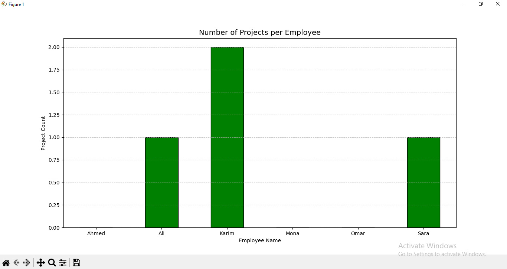

# Python_MySQL_ETL
An automated ETL pipeline using Python and MySQL to extract, analyze, and visualize employee workload data.

# 📊 Corporate Workload Analyzer


## 🚀 Overview
This project is a **Full-Stack Data Analysis Pipeline** that automates the process of extracting employee workload data, analyzing it, and visualizing the results.

The tool performs a full **ETL (Extract, Transform, Load)** process:
1.  **Extract:** Connects to a **MySQL Database** and retrieves data using complex SQL queries (`LEFT JOIN`) to include all employees.
2.  **Transform:** Cleans and aggregates data using **Pandas** to calculate the number of projects per employee.
3.  **Visualize:** Generates a professional Bar Chart using **Matplotlib** to identify workload distribution.

## 📊 Analysis Output
> Below is the generated report showing the number of projects assigned to each employee.



## 🛠️ Tech Stack
* **Language:** Python
* **Database:** MySQL
* **Libraries:**
    * `mysql-connector-python` (Database Connectivity)
    * `pandas` (Data Manipulation & Aggregation)
    * `matplotlib` (Data Visualization)

## ⚙️ How It Works
1.  The script checks if the database and tables exist (and creates them if missing).
2.  It populates the tables with sample dummy data for testing.
3.  It runs a SQL query to join `Employees` and `Projects` tables.
4.  Finally, it exports the analysis as a bar chart.

## 💻 How to Run
1.  Clone this repository.
2.  Install dependencies:
    ```bash
    pip install mysql-connector-python pandas matplotlib
    ```
3.  Run the script:
    ```bash
    python MyCompany.py
    ```

---
**Created by [Karim]** | Data Science Enthusiast
